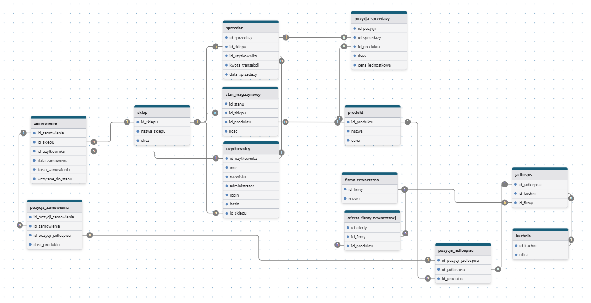
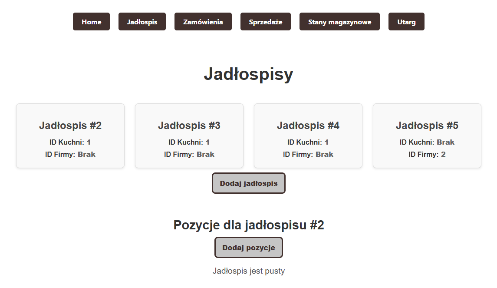
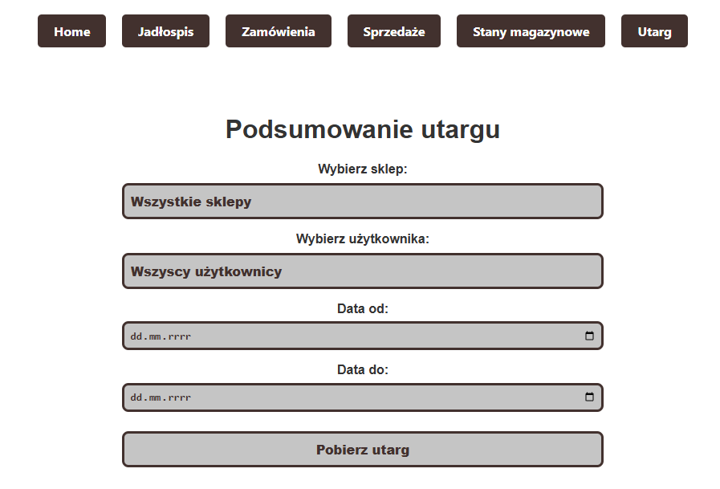

# System Zarządzania Sprzedażą  

System do zarządzania lokalną firmą kateringową posiadającą punkt gastronomiczny oraz trzy punkty sprzedaży we Wrocławiu. 

##  Funkcjonalności  
-  Integracja między kuchnią a sklepami  
-  Zbieranie danych o sprzedaży i zamówieniach  
-  Podgląd stanów magazynowych i utargu z wybranego przedziału czasowego  
-  Dodawanie produktów
-  Tworzenie zamówień oraz sprzedaży 

##  Technologie  
- **PostgreSQL** – baza danych  
- **Go** – backend  
- **Svelte** – frontend  
- **REST API** – komunikacja między komponentami  

##  Uruchomienie  

### 1️⃣ Wymagania  
- [Go](https://go.dev/doc/install)  
- [Node.js](https://nodejs.org/) + [npm](https://www.npmjs.com/)  
- [PostgreSQL](https://www.postgresql.org/download/)  

### 2️⃣ Konfiguracja pliku .env
Należy skonfigurować plik .env zgodnie z danymi bazy danych. Dane użyte w tym projekcie:
```sh
DB_HOST=localhost
DB_PORT=5432
DB_USER=postgres
DB_PASS=1234
DB_NAME=BazaProjekt
BD_SSLMODE=disable
```

### 3️⃣ Uruchomienie serwera z bazą danych
Do poprawnej komunikacji niezbędne jest wcześniejsze włączenie serwera.

### 4️⃣ Uruchomienie backendu (Go)
W głównym katalogu należy uruchomić plik main.go
```sh
go mod tidy
go run main.go
```

### 5️⃣ Uruchomienie frontendu (Svelte)
```sh
cd frontend
npm install
npm run dev
```






